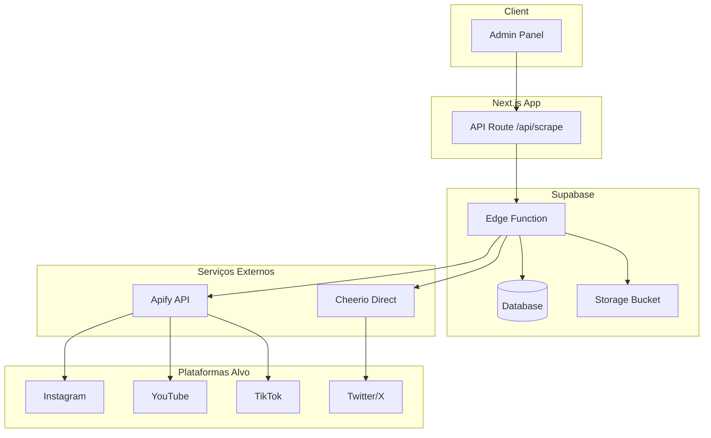
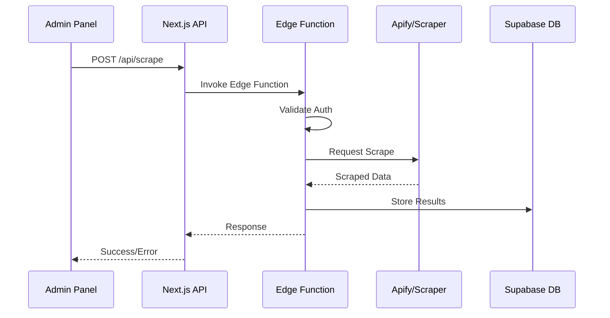

# docs/pesquisa-scraping.md — Pesquisa de Web Scraping para Creators

**Última atualização:** 2026-02-24
**Versão:** 1.0
**Status:** Pesquisa completa

---

## 1. Visão Geral

Este documento pesquisa abordagens de web scraping para agregar conteúdo de plataformas de creators (Instagram, YouTube, TikTok, Twitter/X) no Empire Site, utilizando a arquitetura Next.js + Supabase Edge Functions.

### Contexto Atual

O projeto já possui Edge Functions implementadas para scraping:
- [`scrape-instagram/index.ts`](supabase/functions/scrape-instagram/index.ts) - Usa Apify API
- [`scrape-youtube/index.ts`](supabase/functions/scrape-youtube/index.ts) - Usa Apify API

Esta pesquisa expande as opções para incluir soluções self-hosted e melhores práticas.

---

## 2. Bibliotecas Recomendadas

### 2.1 Cheerio (HTML Estático)

**Melhor para:** Páginas com conteúdo renderizado no servidor

```typescript
// Exemplo: Supabase Edge Function com Cheerio
import { serve } from 'https://deno.land/std@0.168.0/http/server.ts'
import * as cheerio from 'https://esm.sh/cheerio@1.0.0-rc.12'

serve(async (req) => {
    const { url } = await req.json()
    
    const response = await fetch(url, {
        headers: {
            'User-Agent': 'Mozilla/5.0 (compatible; EmpireBot/1.0)',
        },
    })
    
    const html = await response.text()
    const $ = cheerio.load(html)
    
    // Extrair dados
    const title = $('title').text()
    const metaDescription = $('meta[name="description"]').attr('content')
    const ogImage = $('meta[property="og:image"]').attr('content')
    
    return new Response(JSON.stringify({ title, metaDescription, ogImage }), {
        headers: { 'Content-Type': 'application/json' },
    })
})
```

**Vantagens:**
- Leve e rápido
- Baixo consumo de memória
- Sintaxe similar ao jQuery
- Compatível com Deno/Edge Functions

**Limitações:**
- Não executa JavaScript
- Não funciona com SPAs
- Pode ser bloqueado por Cloudflare/bot detection

### 2.2 Puppeteer (Browser Real)

**Melhor para:** SPAs, páginas com autenticação, conteúdo dinâmico

```typescript
// NOTA: Puppeteer não roda diretamente em Edge Functions
// Usar apenas em servidor dedicado ou via serviço externo

import puppeteer from 'puppeteer'

async function scrapeDynamicContent(url: string) {
    const browser = await puppeteer.launch({
        headless: 'new',
        args: ['--no-sandbox', '--disable-setuid-sandbox'],
    })
    
    try {
        const page = await browser.newPage()
        
        // Set user agent to avoid detection
        await page.setUserAgent('Mozilla/5.0 (Windows NT 10.0; Win64; x64) AppleWebKit/537.36')
        
        await page.goto(url, { waitUntil: 'networkidle2' })
        
        // Wait for dynamic content
        await page.waitForSelector('.content-loaded', { timeout: 10000 })
        
        const data = await page.evaluate(() => {
            return {
                title: document.querySelector('h1')?.textContent || '',
                content: document.querySelector('.main-content')?.innerHTML || '',
            }
        })
        
        return data
    } finally {
        await browser.close()
    }
}
```

**Vantagens:**
- Renderiza JavaScript completo
- Pode interagir com a página (clicks, scrolls)
- Screenshots e PDFs
- Suporte a autenticação

**Limitações:**
- Alto consumo de recursos
- Não roda em Edge Functions (precisa de servidor)
- Mais lento que Cheerio

### 2.3 Playwright (Alternativa ao Puppeteer)

**Melhor para:** Cross-browser testing, scraping avançado

```typescript
import { chromium } from 'playwright'

async function scrapeWithPlaywright(url: string) {
    const browser = await chromium.launch({ headless: true })
    const context = await browser.newContext({
        userAgent: 'Mozilla/5.0 (Windows NT 10.0; Win64; x64) AppleWebKit/537.36',
    })
    const page = await context.newPage()
    
    await page.goto(url)
    
    // Block unnecessary resources for faster scraping
    await page.route('**/*', (route) => {
        const resourceType = route.request().resourceType()
        if (['image', 'stylesheet', 'font', 'media'].includes(resourceType)) {
            route.abort()
        } else {
            route.continue()
        }
    })
    
    const data = await page.locator('.content').allTextContents()
    
    await browser.close()
    return data
}
```

**Vantagens sobre Puppeteer:**
- Suporte nativo a Firefox e WebKit
- Auto-wait mais inteligente
- Melhor API para seletores
- Network interception mais robusta

### 2.4 Apify (Solução Atual - Recomendada para Produção)

**Melhor para:** Scraping em escala, anti-detection, manutenção zero

O projeto já usa Apify via Edge Functions. Esta é a abordagem recomendada para produção.

```typescript
// Já implementado em supabase/functions/scrape-instagram/index.ts
const APIFY_API_URL = 'https://api.apify.com/v2'

async function scrapeWithApify(actorId: string, input: object) {
    const response = await fetch(
        `${APIFY_API_URL}/acts/${actorId}/run-sync-get-dataset-items`,
        {
            method: 'POST',
            headers: {
                'Content-Type': 'application/json',
                'Authorization': `Bearer ${APIFY_API_KEY}`,
            },
            body: JSON.stringify(input),
        }
    )
    
    return response.json()
}
```

**Atores Apify Úteis para Creators:**

| Plataforma | Actor ID | Uso |
|------------|----------|-----|
| Instagram | `apify/instagram-post-scraper` | Posts individuais |
| Instagram | `apify/instagram-profile-scraper` | Perfis completos |
| YouTube | `handlebar/youtube-transcript-scraper` | Transcrições |
| YouTube | `streamers/youtube-scraper` | Videos, canais |
| TikTok | `apify/tiktok-scraper` | Videos, perfis |
| Twitter/X | `apify/twitter-scraper` | Tweets, perfis |

---

## 3. Arquitetura do Serviço de Scraping

### 3.1 Diagrama de Arquitetura



### 3.2 Fluxo de Dados



---

## 4. Implementação em Edge Functions

### 4.1 Estrutura de Arquivos

```
supabase/functions/
├── scrape-content/
│   ├── index.ts           # Handler principal
│   ├── deno.json          # Dependências Deno
│   └── lib/
│       ├── apify.ts       # Cliente Apify
│       ├── cheerio.ts     # Cliente Cheerio
│       ├── validators.ts  # Validação de URL
│       └── transformers.ts # Transformação de dados
├── scrape-instagram/
│   └── index.ts           # Já implementado
└── scrape-youtube/
    └── index.ts           # Já implementado
```

### 4.2 Edge Function Genérica de Scraping

```typescript
// supabase/functions/scrape-content/index.ts
import { serve } from 'https://deno.land/std@0.168.0/http/server.ts'
import { createClient } from 'https://esm.sh/@supabase/supabase-js@2'
import * as cheerio from 'https://esm.sh/cheerio@1.0.0-rc.12'

interface ScrapeRequest {
    url: string
    platform: 'instagram' | 'youtube' | 'tiktok' | 'twitter' | 'generic'
    options?: {
        extractImages?: boolean
        extractLinks?: boolean
        extractMetadata?: boolean
    }
}

interface ScrapeResult {
    success: boolean
    data?: {
        title?: string
        description?: string
        content?: string
        images?: string[]
        links?: string[]
        metadata?: Record<string, string>
        platform: string
        scrapedAt: string
    }
    error?: string
}

const APIFY_API_URL = 'https://api.apify.com/v2'

serve(async (req) => {
    const headers = {
        'Access-Control-Allow-Origin': '*',
        'Access-Control-Allow-Headers': 'authorization, x-client-info, apikey, content-type',
    }

    if (req.method === 'OPTIONS') {
        return new Response('ok', { headers })
    }

    try {
        // Auth validation
        const supabaseClient = createClient(
            Deno.env.get('SUPABASE_URL') ?? '',
            Deno.env.get('SUPABASE_ANON_KEY') ?? '',
            {
                global: {
                    headers: { Authorization: req.headers.get('Authorization') ?? '' },
                },
            }
        )

        const { data: { user }, error: authError } = await supabaseClient.auth.getUser()
        if (authError || !user) {
            return new Response(
                JSON.stringify({ error: 'Unauthorized' }),
                { status: 401, headers: { ...headers, 'Content-Type': 'application/json' } }
            )
        }

        const body: ScrapeRequest = await req.json()
        const { url, platform, options = {} } = body

        if (!url) {
            return new Response(
                JSON.stringify({ error: 'URL is required' }),
                { status: 400, headers: { ...headers, 'Content-Type': 'application/json' } }
            )
        }

        let result: ScrapeResult

        // Route to appropriate scraper
        switch (platform) {
            case 'instagram':
                result = await scrapeInstagram(url)
                break
            case 'youtube':
                result = await scrapeYouTube(url)
                break
            case 'tiktok':
                result = await scrapeTikTok(url)
                break
            case 'twitter':
                result = await scrapeTwitter(url)
                break
            default:
                result = await scrapeGeneric(url, options)
        }

        // Log the scrape operation
        await supabaseClient.from('scrape_logs').insert({
            user_id: user.id,
            url,
            platform,
            success: result.success,
            scraped_at: new Date().toISOString(),
        })

        return new Response(
            JSON.stringify(result),
            { headers: { ...headers, 'Content-Type': 'application/json' } }
        )
    } catch (error) {
        return new Response(
            JSON.stringify({ error: error.message }),
            { status: 500, headers: { ...headers, 'Content-Type': 'application/json' } }
        )
    }
})

// Platform-specific scrapers using Apify
async function scrapeInstagram(url: string): Promise<ScrapeResult> {
    const apifyToken = Deno.env.get('APIFY_API_KEY')
    
    const response = await fetch(
        `${APIFY_API_URL}/acts/apify~instagram-post-scraper/run-sync-get-dataset-items`,
        {
            method: 'POST',
            headers: {
                'Content-Type': 'application/json',
                'Authorization': `Bearer ${apifyToken}`,
            },
            body: JSON.stringify({ postUrls: [url] }),
        }
    )

    if (!response.ok) {
        return { success: false, error: `Apify error: ${response.status}` }
    }

    const items = await response.json()
    const post = items[0]

    if (!post) {
        return { success: false, error: 'Post not found' }
    }

    return {
        success: true,
        data: {
            title: post.ownerUsername || '',
            description: post.caption || '',
            content: post.caption || '',
            images: [post.displayUrl || post.imageUrl],
            metadata: {
                likes: String(post.likesCount || 0),
                comments: String(post.commentsCount || 0),
                hashtags: (post.hashtags || []).join(', '),
            },
            platform: 'instagram',
            scrapedAt: new Date().toISOString(),
        },
    }
}

async function scrapeTikTok(url: string): Promise<ScrapeResult> {
    const apifyToken = Deno.env.get('APIFY_API_KEY')
    
    const response = await fetch(
        `${APIFY_API_URL}/acts/apify~tiktok-scraper/run-sync-get-dataset-items`,
        {
            method: 'POST',
            headers: {
                'Content-Type': 'application/json',
                'Authorization': `Bearer ${apifyToken}`,
            },
            body: JSON.stringify({ 
                posts: [url],
                scrapeType: 'post',
            }),
        }
    )

    if (!response.ok) {
        return { success: false, error: `Apify error: ${response.status}` }
    }

    const items = await response.json()
    const video = items[0]

    if (!video) {
        return { success: false, error: 'Video not found' }
    }

    return {
        success: true,
        data: {
            title: video.text || '',
            description: video.text || '',
            content: video.text || '',
            images: [video.video?.cover],
            metadata: {
                plays: String(video.playCount || 0),
                likes: String(video.diggCount || 0),
                shares: String(video.shareCount || 0),
                author: video.author?.uniqueId || '',
            },
            platform: 'tiktok',
            scrapedAt: new Date().toISOString(),
        },
    }
}

// Generic scraper using Cheerio (for simple pages)
async function scrapeGeneric(url: string, options: any): Promise<ScrapeResult> {
    try {
        const response = await fetch(url, {
            headers: {
                'User-Agent': 'Mozilla/5.0 (compatible; EmpireBot/1.0; +https://empire.com.br)',
            },
        })

        if (!response.ok) {
            return { success: false, error: `HTTP error: ${response.status}` }
        }

        const html = await response.text()
        const $ = cheerio.load(html)

        const data: any = {
            title: $('title').text().trim(),
            description: $('meta[name="description"]').attr('content') || 
                        $('meta[property="og:description"]').attr('content') || '',
            platform: 'generic',
            scrapedAt: new Date().toISOString(),
        }

        if (options.extractImages) {
            data.images = []
            $('img').each((_, el) => {
                const src = $(el).attr('src')
                if (src) data.images.push(src)
            })
        }

        if (options.extractLinks) {
            data.links = []
            $('a').each((_, el) => {
                const href = $(el).attr('href')
                if (href) data.links.push(href)
            })
        }

        if (options.extractMetadata) {
            data.metadata = {}
            $('meta').each((_, el) => {
                const name = $(el).attr('name') || $(el).attr('property')
                const content = $(el).attr('content')
                if (name && content) {
                    data.metadata[name] = content
                }
            })
        }

        return { success: true, data }
    } catch (error) {
        return { success: false, error: error.message }
    }
}

async function scrapeTwitter(url: string): Promise<ScrapeResult> {
    // Twitter requires Apify due to authentication
    const apifyToken = Deno.env.get('APIFY_API_KEY')
    
    const response = await fetch(
        `${APIFY_API_URL}/acts/apify~twitter-scraper/run-sync-get-dataset-items`,
        {
            method: 'POST',
            headers: {
                'Content-Type': 'application/json',
                'Authorization': `Bearer ${apifyToken}`,
            },
            body: JSON.stringify({ 
                startUrls: [url],
            }),
        }
    )

    if (!response.ok) {
        return { success: false, error: `Apify error: ${response.status}` }
    }

    const items = await response.json()
    const tweet = items[0]

    if (!tweet) {
        return { success: false, error: 'Tweet not found' }
    }

    return {
        success: true,
        data: {
            title: tweet.user?.name || '',
            description: tweet.text || '',
            content: tweet.text || '',
            images: tweet.photos || [],
            metadata: {
                likes: String(tweet.likes || 0),
                retweets: String(tweet.retweets || 0),
                replies: String(tweet.replies || 0),
                author: tweet.user?.username || '',
            },
            platform: 'twitter',
            scrapedAt: new Date().toISOString(),
        },
    }
}
```

---

## 5. Schema do Banco de Dados

### 5.1 Tabelas para Conteúdo Scraped

```sql
-- Migration: 20250715000018_scraped_content.sql

-- Tabela de logs de scraping
CREATE TABLE scrape_logs (
    id UUID PRIMARY KEY DEFAULT gen_random_uuid(),
    user_id UUID REFERENCES auth.users(id) ON DELETE CASCADE NOT NULL,
    url TEXT NOT NULL,
    platform TEXT NOT NULL,
    success BOOLEAN NOT NULL DEFAULT false,
    error_message TEXT,
    response_time_ms INTEGER,
    scraped_at TIMESTAMPTZ NOT NULL DEFAULT NOW(),
    created_at TIMESTAMPTZ NOT NULL DEFAULT NOW()
);

-- Tabela de conteúdo scrapado
CREATE TABLE scraped_content (
    id UUID PRIMARY KEY DEFAULT gen_random_uuid(),
    user_id UUID REFERENCES auth.users(id) ON DELETE CASCADE NOT NULL,
    source_url TEXT NOT NULL,
    platform TEXT NOT NULL,
    platform_content_id TEXT, -- ID do post/video no platform
    
    -- Dados extraídos
    title TEXT,
    description TEXT,
    content TEXT,
    images TEXT[], -- Array de URLs de imagens
    videos TEXT[], -- Array de URLs de videos
    metadata JSONB DEFAULT '{}', -- Dados extras específicos da plataforma
    
    -- Status
    status TEXT NOT NULL DEFAULT 'pending' CHECK (status IN ('pending', 'processed', 'failed')),
    processed_at TIMESTAMPTZ,
    
    -- Timestamps
    scraped_at TIMESTAMPTZ NOT NULL DEFAULT NOW(),
    created_at TIMESTAMPTZ NOT NULL DEFAULT NOW(),
    updated_at TIMESTAMPTZ NOT NULL DEFAULT NOW(),
    
    -- Unique constraint para evitar duplicatas
    UNIQUE(source_url)
);

-- Tabela de creators seguidos
CREATE TABLE followed_creators (
    id UUID PRIMARY KEY DEFAULT gen_random_uuid(),
    user_id UUID REFERENCES auth.users(id) ON DELETE CASCADE NOT NULL,
    platform TEXT NOT NULL,
    username TEXT NOT NULL,
    platform_user_id TEXT,
    display_name TEXT,
    avatar_url TEXT,
    last_scraped_at TIMESTAMPTZ,
    is_active BOOLEAN NOT NULL DEFAULT true,
    created_at TIMESTAMPTZ NOT NULL DEFAULT NOW(),
    updated_at TIMESTAMPTZ NOT NULL DEFAULT NOW(),
    
    UNIQUE(platform, username)
);

-- Tabela de agendamento de scraping
CREATE TABLE scrape_schedules (
    id UUID PRIMARY KEY DEFAULT gen_random_uuid(),
    creator_id UUID REFERENCES followed_creators(id) ON DELETE CASCADE NOT NULL,
    frequency TEXT NOT NULL DEFAULT 'daily' CHECK (frequency IN ('hourly', 'daily', 'weekly')),
    last_run_at TIMESTAMPTZ,
    next_run_at TIMESTAMPTZ NOT NULL,
    is_active BOOLEAN NOT NULL DEFAULT true,
    created_at TIMESTAMPTZ NOT NULL DEFAULT NOW()
);

-- Índices
CREATE INDEX idx_scrape_logs_user ON scrape_logs(user_id);
CREATE INDEX idx_scrape_logs_platform ON scrape_logs(platform);
CREATE INDEX idx_scrape_logs_scraped_at ON scrape_logs(scraped_at DESC);

CREATE INDEX idx_scraped_content_user ON scraped_content(user_id);
CREATE INDEX idx_scraped_content_platform ON scraped_content(platform);
CREATE INDEX idx_scraped_content_status ON scraped_content(status);
CREATE INDEX idx_scraped_content_source_url ON scraped_content(source_url);

CREATE INDEX idx_followed_creators_user ON followed_creators(user_id);
CREATE INDEX idx_followed_creators_platform ON followed_creators(platform);

CREATE INDEX idx_scrape_schedules_next_run ON scrape_schedules(next_run_at) WHERE is_active = true;

-- RLS Policies
ALTER TABLE scrape_logs ENABLE ROW LEVEL SECURITY;
ALTER TABLE scraped_content ENABLE ROW LEVEL SECURITY;
ALTER TABLE followed_creators ENABLE ROW LEVEL SECURITY;
ALTER TABLE scrape_schedules ENABLE ROW LEVEL SECURITY;

CREATE POLICY "Users can view own scrape logs" ON scrape_logs
    FOR SELECT USING (auth.uid() = user_id);

CREATE POLICY "Users can view own scraped content" ON scraped_content
    FOR SELECT USING (auth.uid() = user_id);

CREATE POLICY "Users can insert own scraped content" ON scraped_content
    FOR INSERT WITH CHECK (auth.uid() = user_id);

CREATE POLICY "Users can update own scraped content" ON scraped_content
    FOR UPDATE USING (auth.uid() = user_id);

CREATE POLICY "Users can manage own followed creators" ON followed_creators
    FOR ALL USING (auth.uid() = user_id);

CREATE POLICY "Users can view own schedules" ON scrape_schedules
    FOR SELECT USING (
        EXISTS (
            SELECT 1 FROM followed_creators 
            WHERE followed_creators.id = scrape_schedules.creator_id 
            AND followed_creators.user_id = auth.uid()
        )
    );

-- Trigger para updated_at
CREATE TRIGGER handle_scraped_content_updated_at
    BEFORE UPDATE ON scraped_content
    FOR EACH ROW
    EXECUTE FUNCTION handle_updated_at();

CREATE TRIGGER handle_followed_creators_updated_at
    BEFORE UPDATE ON followed_creators
    FOR EACH ROW
    EXECUTE FUNCTION handle_updated_at();
```

---

## 6. Tratamento de Erros e Retry

### 6.1 Estratégia de Retry com Backoff Exponencial

```typescript
// lib/scraping/retry.ts

interface RetryOptions {
    maxRetries: number
    baseDelayMs: number
    maxDelayMs: number
    retryableErrors: string[]
}

const DEFAULT_RETRY_OPTIONS: RetryOptions = {
    maxRetries: 3,
    baseDelayMs: 1000,
    maxDelayMs: 30000,
    retryableErrors: [
        'ECONNRESET',
        'ETIMEDOUT',
        'ENOTFOUND',
        '429',  // Rate limited
        '502',  // Bad Gateway
        '503',  // Service Unavailable
        '504',  // Gateway Timeout
    ],
}

async function withRetry<T>(
    fn: () => Promise<T>,
    options: Partial<RetryOptions> = {}
): Promise<T> {
    const opts = { ...DEFAULT_RETRY_OPTIONS, ...options }
    let lastError: Error | null = null
    
    for (let attempt = 0; attempt <= opts.maxRetries; attempt++) {
        try {
            return await fn()
        } catch (error) {
            lastError = error
            
            // Check if error is retryable
            const isRetryable = opts.retryableErrors.some(
                retryable => error.message?.includes(retryable)
            )
            
            if (!isRetryable || attempt === opts.maxRetries) {
                throw error
            }
            
            // Calculate delay with exponential backoff + jitter
            const delay = Math.min(
                opts.baseDelayMs * Math.pow(2, attempt) + Math.random() * 1000,
                opts.maxDelayMs
            )
            
            console.log(`Retry attempt ${attempt + 1}/${opts.maxRetries} after ${delay}ms`)
            await sleep(delay)
        }
    }
    
    throw lastError
}

function sleep(ms: number): Promise<void> {
    return new Promise(resolve => setTimeout(resolve, ms))
}
```

### 6.2 Circuit Breaker Pattern

```typescript
// lib/scraping/circuit-breaker.ts

enum CircuitState {
    CLOSED,    // Normal operation
    OPEN,      // Failing, reject all requests
    HALF_OPEN, // Testing if recovered
}

class CircuitBreaker {
    private state: CircuitState = CircuitState.CLOSED
    private failures: number = 0
    private lastFailureTime: number = 0
    private readonly failureThreshold: number
    private readonly recoveryTimeoutMs: number

    constructor(failureThreshold = 5, recoveryTimeoutMs = 60000) {
        this.failureThreshold = failureThreshold
        this.recoveryTimeoutMs = recoveryTimeoutMs
    }

    async execute<T>(fn: () => Promise<T>): Promise<T> {
        if (this.state === CircuitState.OPEN) {
            if (Date.now() - this.lastFailureTime > this.recoveryTimeoutMs) {
                this.state = CircuitState.HALF_OPEN
            } else {
                throw new Error('Circuit breaker is OPEN')
            }
        }

        try {
            const result = await fn()
            this.onSuccess()
            return result
        } catch (error) {
            this.onFailure()
            throw error
        }
    }

    private onSuccess(): void {
        this.failures = 0
        this.state = CircuitState.CLOSED
    }

    private onFailure(): void {
        this.failures++
        this.lastFailureTime = Date.now()
        
        if (this.failures >= this.failureThreshold) {
            this.state = CircuitState.OPEN
        }
    }

    getState(): CircuitState {
        return this.state
    }
}

// Usage
const apifyCircuitBreaker = new CircuitBreaker(5, 60000)

async function scrapeWithCircuitBreaker<T>(fn: () => Promise<T>): Promise<T> {
    return apifyCircuitBreaker.execute(fn)
}
```

---

## 7. Rate Limiting

### 7.1 Rate Limiter por Plataforma

```typescript
// lib/scraping/rate-limiter.ts

interface RateLimitConfig {
    maxRequests: number
    windowMs: number
}

const PLATFORM_RATE_LIMITS: Record<string, RateLimitConfig> = {
    instagram: { maxRequests: 30, windowMs: 60000 },    // 30 req/min
    youtube: { maxRequests: 100, windowMs: 60000 },     // 100 req/min
    tiktok: { maxRequests: 20, windowMs: 60000 },       // 20 req/min
    twitter: { maxRequests: 15, windowMs: 60000 },      // 15 req/min
    generic: { maxRequests: 60, windowMs: 60000 },      // 60 req/min
}

class RateLimiter {
    private requests: Map<string, number[]> = new Map()
    
    async waitForAvailability(platform: string): Promise<void> {
        const config = PLATFORM_RATE_LIMITS[platform] || PLATFORM_RATE_LIMITS.generic
        const key = platform
        const now = Date.now()
        
        // Get existing requests for this platform
        let timestamps = this.requests.get(key) || []
        
        // Remove old timestamps outside the window
        timestamps = timestamps.filter(ts => now - ts < config.windowMs)
        
        // Check if we're at the limit
        if (timestamps.length >= config.maxRequests) {
            // Calculate wait time
            const oldestTimestamp = timestamps[0]
            const waitTime = oldestTimestamp + config.windowMs - now
            
            if (waitTime > 0) {
                console.log(`Rate limit reached for ${platform}, waiting ${waitTime}ms`)
                await sleep(waitTime)
            }
        }
        
        // Record this request
        timestamps.push(now)
        this.requests.set(key, timestamps)
    }
    
    getRemainingRequests(platform: string): number {
        const config = PLATFORM_RATE_LIMITS[platform] || PLATFORM_RATE_LIMITS.generic
        const timestamps = this.requests.get(platform) || []
        const now = Date.now()
        
        const recentRequests = timestamps.filter(ts => now - ts < config.windowMs)
        return Math.max(0, config.maxRequests - recentRequests.length)
    }
}

// Singleton instance
export const rateLimiter = new RateLimiter()
```

### 7.2 Rate Limiting no Banco de Dados

```sql
-- Function para verificar rate limit no banco
CREATE OR REPLACE FUNCTION check_rate_limit(
    p_user_id UUID,
    p_platform TEXT,
    p_max_requests INTEGER DEFAULT 30,
    p_window_minutes INTEGER DEFAULT 1
) RETURNS BOOLEAN AS $$
DECLARE
    request_count INTEGER;
BEGIN
    SELECT COUNT(*) INTO request_count
    FROM scrape_logs
    WHERE user_id = p_user_id
      AND platform = p_platform
      AND scraped_at > NOW() - (p_window_minutes || ' minutes')::INTERVAL;
    
    RETURN request_count < p_max_requests;
END;
$$ LANGUAGE plpgsql SECURITY DEFINER;
```

---

## 8. Considerações Éticas e Legais

### 8.1 Boas Práticas

1. **Respeitar robots.txt**
```typescript
async function checkRobotsTxt(url: string): Promise<boolean> {
    const baseUrl = new URL(url).origin
    const robotsUrl = `${baseUrl}/robots.txt`
    
    try {
        const response = await fetch(robotsUrl)
        const robotsTxt = await response.text()
        
        // Simple check - in production use a proper parser
        const userAgent = 'EmpireBot'
        const lines = robotsTxt.split('\n')
        let currentUserAgent = ''
        
        for (const line of lines) {
            if (line.startsWith('User-agent:')) {
                currentUserAgent = line.split(':')[1].trim()
            }
            if ((currentUserAgent === '*' || currentUserAgent === userAgent) &&
                line.startsWith('Disallow:')) {
                const disallowedPath = line.split(':')[1].trim()
                if (url.includes(disallowedPath) && disallowedPath !== '/') {
                    return false
                }
            }
        }
        
        return true
    } catch {
        // If robots.txt doesn't exist, assume allowed
        return true
    }
}
```

2. **User Agent Identificação**
```typescript
const SCRAPER_USER_AGENT = 'Mozilla/5.0 (compatible; EmpireBot/1.0; +https://empire.com.br/bot)'
```

3. **Rate Limiting Respeitoso**
- Sempre implementar delays entre requisições
- Respeitar headers `Retry-After`
- Não sobrecarregar servidores

4. **Termos de Serviço**
- Instagram: Proíbe scraping automatizado - **USAR APIFY**
- YouTube: Permite embed, transcrições requerem API - **USAR APIFY**
- TikTok: ToS proíbe scraping - **USAR APIFY**
- Twitter/X: Proíbe scraping - **USAR APIFY**

### 8.2 Recomendação Final

Para plataformas sociais (Instagram, YouTube, TikTok, Twitter), **sempre usar Apify** ou APIs oficiais quando disponíveis. O scraping direto viola ToS e pode resultar em:

- Bloqueio de IP
- Ações legais
- Dados inconsistentes (plataformas mudam HTML frequentemente)

---

## 9. Custos Estimados

### 9.1 Apify Pricing

| Plano | Custo/mês | Créditos | Ideal para |
|-------|-----------|----------|------------|
| Free | $0 | $5 créditos | Testes |
| Starter | $49 | $49 créditos | Pequeno volume |
| Team | $149 | $149 créditos | Médio volume |
| Business | $499 | $499 créditos | Alto volume |

### 9.2 Estimativa de Uso

| Operação | Custo Apify Estimado |
|----------|---------------------|
| Instagram Post | ~$0.003/post |
| YouTube Transcript | ~$0.01/video |
| TikTok Video | ~$0.005/video |
| Twitter Tweet | ~$0.002/tweet |

**Exemplo:** 1000 posts Instagram/mês = ~$3/mês em créditos Apify

---

## 10. Próximos Passos

1. **Imediato:** Usar Edge Functions existentes com Apify
2. **Curto prazo:** Implementar tabelas de `scraped_content` e `followed_creators`
3. **Médio prazo:** Criar painel admin para gerenciar creators seguidos
4. **Longo prazo:** Implementar scraping agendado com pg_cron ou similar

---

## 11. Referências

- [Apify Documentation](https://docs.apify.com/)
- [Cheerio Documentation](https://cheerio.js.org/)
- [Puppeteer Documentation](https://pptr.dev/)
- [Playwright Documentation](https://playwright.dev/)
- [Supabase Edge Functions](https://supabase.com/docs/guides/functions)
- [Robots.txt Specification](https://www.robotstxt.org/)
- [Web Scraping Legal Considerations](https://benbernardblog.com/web-scraping-and-crawling-are-permissible-if-the-data-is-public/)

---

## Histórico de Mudanças

| Data | Mudança | Autor |
|------|---------|-------|
| 2026-02-24 | Criação da pesquisa completa | G04-T02 |
