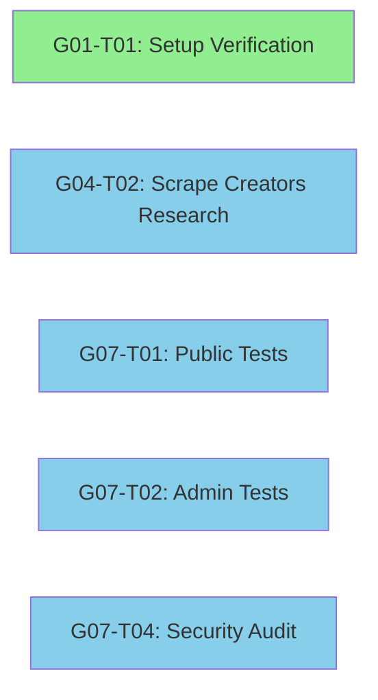
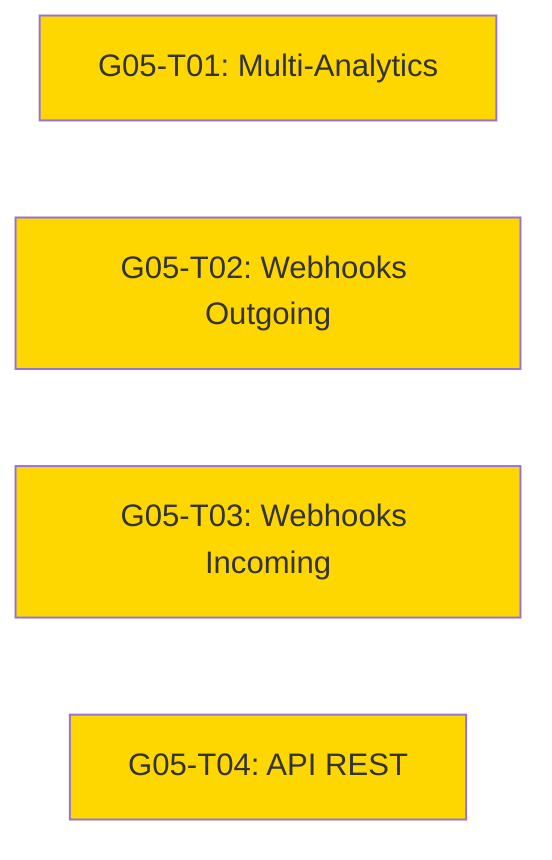
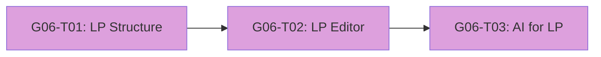
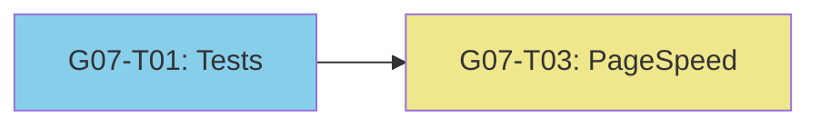

# Empire Site - Execution Plan for Pending Tasks

**Generated:** 2026-02-24
**Project:** v3-empire-site
**Status:** Analysis Complete

---

## Executive Summary

This document outlines the execution plan for completing all pending tasks from the project roadmap. The project is a Next.js 16+ application with Supabase backend, featuring a public website (dark mode Empire Gold theme), admin panel (light mode), blog system, AI content generation via OpenRouter, and landing page capabilities.

### Current Progress Overview

| Group | Name | Total | Done | Pending | Progress |
|-------|------|-------|------|---------|----------|
| G01 | Foundation | 6 | 5 | 1 | 83% |
| G02 | Site Público | 5 | 5 | 0 | 100% |
| G03 | Admin Core | 5 | 5 | 0 | 100% |
| G04 | IA e Conteúdo | 5 | 4 | 1 | 80% |
| G05 | Integrações | 4 | 0 | 4 | 0% |
| G06 | Landing Pages | 3 | 0 | 3 | 0% |
| G07 | Qualidade | 4 | 0 | 4 | 0% |
| **Total** | | **32** | **19** | **13** | **59%** |

---

## Project Current State

### Technology Stack (Verified)
- **Framework:** Next.js 16.1.6 (App Router)
- **Language:** TypeScript 5+ (strict mode)
- **Styling:** Tailwind CSS 4
- **Database/Auth/Storage:** Supabase
- **Rich Editor:** TipTap 3.20+
- **AI:** OpenRouter API (multi-model support)
- **UI Components:** Radix UI primitives

### Completed Features
- ✅ Design System Empire Gold (dark/light themes)
- ✅ Supabase configuration with 17 migrations
- ✅ Authentication with role-based access (5 roles)
- ✅ Route structure (public, admin, auth, api)
- ✅ Homepage, Blog, Institutional pages
- ✅ SEO technical implementation
- ✅ Admin panel with dashboard
- ✅ Post management with TipTap editor
- ✅ Media library with folders
- ✅ User management with permissions
- ✅ OpenRouter integration for AI
- ✅ AI content generation panel
- ✅ Automatic SEO with AI

### Pending Implementation
The following 13 tasks remain to be completed.

---

## Pending Tasks Detail

### G01-T01 — Setup do Projeto ⚠️ VERIFICATION NEEDED

**Status:** TODO 0% (may be outdated)
**Priority:** High (foundational)
**Dependencies:** None

> **Note:** Based on codebase analysis, this task appears mostly complete. The project structure exists with all required files. A verification pass is recommended.

#### Verification Checklist
- [ ] Confirm Next.js 14+ App Router + TypeScript strict configured
- [ ] Verify Tailwind CSS configured with tokens
- [ ] Check `.env.example` has all required variables
- [ ] Verify `.gitignore` is correct
- [ ] Confirm `docs/prd.md` and `docs/claude.md` exist
- [ ] Verify ESLint/Prettier configuration
- [ ] Confirm project runs without errors (`npm run dev`)

#### Requirements
| Item | Type | Complexity |
|------|------|------------|
| Project structure verification | Configuration | Low |
| Missing configurations | Configuration | Low |

#### Risk Assessment
- **Risk:** Documentation out of sync with reality
- **Mitigation:** Quick verification pass, update task status if complete

---

### G04-T02 — Pesquisa Scrape Creators API

**Status:** TODO 0%
**Priority:** Medium
**Dependencies:** None (can run in parallel)

#### Description
Research and document the Scrape Creators API for Instagram/YouTube content extraction and transformation into blog posts.

#### Requirements
| Item | Type | Complexity |
|------|------|------------|
| API documentation research | Documentation | Medium |
| Endpoint mapping | Documentation | Medium |
| Authentication method | Documentation | Low |
| Rate limits documentation | Documentation | Low |
| Update `docs/integracoes.md` | Documentation | Medium |

#### Deliverables
1. Complete documentation section in [`docs/integracoes.md`](docs/integracoes.md)
2. Implementation plan for scrape functions
3. Update [`src/lib/scrape-creators/client.ts`](src/lib/scrape-creators/client.ts:1) with actual implementation

#### Risk Assessment
- **Risk:** API may have changed or be unavailable
- **Mitigation:** Verify API availability before detailed planning
- **Fallback:** Research alternative scraping solutions

---

### G05-T01 — Multi-Analytics

**Status:** TODO 0%
**Priority:** High
**Dependencies:** None

#### Description
Implement multi-analytics support including Google Analytics 4, Google Tag Manager, Facebook Pixel, Hotjar, and Microsoft Clarity with admin configuration panel.

#### Requirements
| Item | Type | Complexity |
|------|------|------------|
| Database schema for analytics configs | Database | Low |
| Admin UI for analytics configuration | Code | Medium |
| Script injection system | Code | High |
| GA4 integration | Code | Medium |
| GTM integration | Code | Medium |
| Facebook Pixel integration | Code | Medium |
| Hotjar integration | Code | Low |
| Microsoft Clarity integration | Code | Low |
| Preview mode (disable in dev) | Code | Low |

#### Implementation Files
- [`src/app/(admin)/admin/configuracoes/analytics/page.tsx`](src/app/(admin)/admin/configuracoes/analytics/page.tsx:1) - Admin UI
- [`src/app/api/analytics/route.ts`](src/app/api/analytics/route.ts:1) - API endpoint
- [`src/components/shared/AnalyticsScripts.tsx`](src/components/shared/AnalyticsScripts.tsx) - Script loader (new)
- [`src/lib/analytics/`](src/lib/analytics/) - Analytics client library (new)

#### Database
Table `analytics_configs` already exists (migration `20250715000010_analytics_configs.sql`)

#### Risk Assessment
- **Risk:** Cookie consent requirements (GDPR/LGPD)
- **Mitigation:** Implement consent management in future iteration
- **Risk:** Performance impact of multiple scripts
- **Mitigation:** Lazy load non-critical scripts

---

### G05-T02 — Webhooks Outgoing

**Status:** TODO 0%
**Priority:** Medium
**Dependencies:** None

#### Description
Implement outgoing webhook system to notify external services of events (post published, user created, etc.).

#### Requirements
| Item | Type | Complexity |
|------|------|------------|
| Admin UI for webhook management | Code | Medium |
| Webhook trigger system | Code | High |
| HMAC-SHA256 signature | Code | Medium |
| Retry logic with exponential backoff | Code | High |
| Webhook logs UI | Code | Medium |

#### Events to Support
- `post.published`
- `post.updated`
- `post.deleted`
- `user.created`
- `lp.published`
- `lp.converted`

#### Implementation Files
- [`src/app/(admin)/admin/configuracoes/webhooks/page.tsx`](src/app/(admin)/admin/configuracoes/webhooks/page.tsx:1) - Admin UI
- [`src/lib/webhooks/outgoing.ts`](src/lib/webhooks/outgoing.ts) - Webhook client (new)
- [`src/lib/webhooks/retry.ts`](src/lib/webhooks/retry.ts) - Retry logic (new)

#### Database
Tables `webhook_configs` and `webhook_logs` already exist

#### Risk Assessment
- **Risk:** External endpoint failures
- **Mitigation:** Robust retry logic, dead letter queue for persistent failures

---

### G05-T03 — Webhooks Incoming

**Status:** TODO 0%
**Priority:** Medium
**Dependencies:** None

#### Description
Implement incoming webhook endpoint to receive events from external services.

#### Requirements
| Item | Type | Complexity |
|------|------|------------|
| Dynamic endpoint `/api/webhooks/[slug]` | Code | Medium |
| Signature verification | Code | Medium |
| Async processing | Code | Medium |
| Event logging | Code | Low |
| Admin UI for configuration | Code | Medium |

#### Implementation Files
- [`src/app/api/webhooks/[slug]/route.ts`](src/app/api/webhooks/[slug]/route.ts:1) - Endpoint (stub exists)
- [`src/lib/webhooks/incoming.ts`](src/lib/webhooks/incoming.ts) - Handler (new)
- [`src/lib/webhooks/verify.ts`](src/lib/webhooks/verify.ts) - Signature verification (new)

#### Risk Assessment
- **Risk:** Malicious webhook payloads
- **Mitigation:** Strict signature verification, input validation

---

### G05-T04 — API REST Pública

**Status:** TODO 0%
**Priority:** Medium
**Dependencies:** None

#### Description
Implement public REST API for external access to posts, categories, and tags with API key authentication for write operations.

#### Requirements
| Item | Type | Complexity |
|------|------|------------|
| Public endpoints (read) | Code | Medium |
| Authenticated endpoints (write) | Code | High |
| API key management UI | Code | Medium |
| Rate limiting | Code | High |
| API documentation | Documentation | Medium |

#### Endpoints
```
GET  /api/posts           → List posts (paginated)
GET  /api/posts/[slug]    → Get post by slug
GET  /api/categories      → List categories
GET  /api/tags            → List tags
POST /api/posts           → Create post (API key required)
PUT  /api/posts/[id]      → Update post (API key required)
DELETE /api/posts/[id]    → Soft delete post (API key required)
```

#### Implementation Files
- [`src/app/api/posts/route.ts`](src/app/api/posts/route.ts:1) - Posts API (stub exists)
- [`src/app/api/posts/[id]/route.ts`](src/app/api/posts/[id]/route.ts:1) - Single post API (stub exists)
- [`src/lib/api/rate-limit.ts`](src/lib/api/rate-limit.ts) - Rate limiting (new)
- [`src/lib/api/auth.ts`](src/lib/api/auth.ts) - API key validation (new)
- [`docs/api.md`](docs/api.md) - API documentation (new)

#### Database
Table `api_keys` already exists

#### Risk Assessment
- **Risk:** API abuse
- **Mitigation:** Rate limiting per API key, request logging

---

### G06-T01 — Estrutura LP (Landing Pages Structure)

**Status:** TODO 0%
**Priority:** High
**Dependencies:** None

#### Description
Implement the database schema and basic structure for landing pages with isolated layout.

#### Requirements
| Item | Type | Complexity |
|------|------|------------|
| LP template components | Code | High |
| Dynamic LP rendering | Code | High |
| Isolated layout | Code | Medium |
| SEO per LP | Code | Medium |

#### Section Types to Implement
- Hero section
- Benefits section
- CTA section
- Social proof section
- FAQ section
- Form section

#### Implementation Files
- [`src/app/(public)/lp/[slug]/page.tsx`](src/app/(public)/lp/[slug]/page.tsx:1) - Dynamic LP page (stub exists)
- [`src/app/(public)/lp/layout.tsx`](src/app/(public)/lp/layout.tsx:1) - Isolated layout
- [`src/components/lp/sections/`](src/components/lp/sections/) - Section components (new)
- [`src/lib/lp/renderer.ts`](src/lib/lp/renderer.ts) - Section renderer (new)

#### Database
Table `landing_pages` already exists with `sections` JSONB column

#### Risk Assessment
- **Risk:** Complex section rendering
- **Mitigation:** Start with simple sections, iterate

---

### G06-T02 — Editor de Seções LP (LP Section Editor)

**Status:** TODO 0%
**Priority:** High
**Dependencies:** G06-T01

#### Description
Admin interface for creating and editing landing pages with section management.

#### Requirements
| Item | Type | Complexity |
|------|------|------------|
| LP list page | Code | Medium |
| LP editor page | Code | High |
| Section add/remove UI | Code | High |
| Drag-and-drop reordering | Code | High |
| Section content editor | Code | High |
| Preview functionality | Code | Medium |
| Publish/draft status | Code | Low |

#### Implementation Files
- [`src/app/(admin)/admin/landing-pages/page.tsx`](src/app/(admin)/admin/landing-pages/page.tsx:1) - List page (stub exists)
- [`src/app/(admin)/admin/landing-pages/nova/page.tsx`](src/app/(admin)/admin/landing-pages/nova/page.tsx:1) - Create page (stub exists)
- [`src/app/(admin)/admin/landing-pages/[id]/page.tsx`](src/app/(admin)/admin/landing-pages/[id]/page.tsx:1) - Edit page (stub exists)
- [`src/components/admin/lp/`](src/components/admin/lp/) - LP admin components (new)

#### Risk Assessment
- **Risk:** Complex state management
- **Mitigation:** Use React hooks carefully, consider state library if needed

---

### G06-T03 — IA para LP (AI for Landing Pages)

**Status:** TODO 0%
**Priority:** Medium
**Dependencies:** G06-T01, G06-T02

#### Description
AI-assisted landing page generation using OpenRouter.

#### Requirements
| Item | Type | Complexity |
|------|------|------------|
| AI prompt templates for LP | Code | Medium |
| Section content generation | Code | High |
| Full LP generation | Code | High |
| Integration with existing AI panel | Code | Medium |

#### Implementation Files
- [`src/lib/ai/lp-prompts.ts`](src/lib/ai/lp-prompts.ts) - LP-specific prompts (new)
- [`src/components/admin/lp/AIGenerator.tsx`](src/components/admin/lp/AIGenerator.tsx) - AI UI component (new)

#### Risk Assessment
- **Risk:** AI-generated content quality
- **Mitigation:** Allow regeneration, manual editing

---

### G07-T01 — Testes Rotas Públicas (Public Routes Tests)

**Status:** TODO 0%
**Priority:** High
**Dependencies:** None (can run in parallel)

#### Description
Implement automated tests for all public routes.

#### Requirements
| Item | Type | Complexity |
|------|------|------------|
| Test framework setup | Configuration | Medium |
| Homepage tests | Test | Low |
| Blog list tests | Test | Low |
| Blog post tests | Test | Low |
| Category page tests | Test | Low |
| Institutional page tests | Test | Low |
| LP tests | Test | Medium |
| SEO metadata tests | Test | Medium |

#### Recommended Tools
- **Vitest** - Test runner (fast, Vite-native)
- **Playwright** - E2E testing
- **@testing-library/react** - Component testing

#### Test Cases
```
Public Routes:
├── Homepage
│   ├── renders without error
│   ├── displays hero section
│   └── shows recent posts
├── Blog
│   ├── list page renders
│   ├── pagination works
│   ├── category filter works
│   └── post page renders with content
├── Institutional
│   ├── sobre page renders
│   └── contato page renders
└── LP
    ├── renders with correct sections
    └── isolated layout (no navbar/footer when configured)
```

#### Risk Assessment
- **Risk:** Test maintenance overhead
- **Mitigation:** Focus on critical paths first

---

### G07-T02 — Testes Fluxo Admin (Admin Flow Tests)

**Status:** TODO 0%
**Priority:** High
**Dependencies:** None (can run in parallel)

#### Description
Implement automated tests for admin panel flows.

#### Requirements
| Item | Type | Complexity |
|------|------|------------|
| Authentication flow tests | Test | High |
| Post CRUD tests | Test | Medium |
| Media library tests | Test | Medium |
| User management tests | Test | Medium |
| Role-based access tests | Test | High |
| AI generation tests | Test | Medium |

#### Test Cases
```
Admin Flows:
├── Authentication
│   ├── login success redirects to dashboard
│   ├── login failure shows error
│   ├── logout clears session
│   └── unauthenticated access redirects to login
├── Posts
│   ├── create post
│   ├── edit post
│   ├── publish post
│   ├── schedule post
│   └── delete post (soft)
├── Media
│   ├── upload file
│   ├── create folder
│   └── delete file
├── Users
│   ├── list users
│   ├── change role
│   └── deactivate user
└── Permissions
    ├── viewer cannot edit
    ├── author can edit own posts
    ├── editor can edit all posts
    └── admin can manage users
```

#### Risk Assessment
- **Risk:** Test environment setup complexity
- **Mitigation:** Use Supabase local development for isolated testing

---

### G07-T03 — Otimização PageSpeed (PageSpeed Optimization)

**Status:** TODO 0%
**Priority:** Medium
**Dependencies:** G07-T01 (for baseline metrics)

#### Description
Optimize application for 90+ PageSpeed score on mobile and desktop.

#### Requirements
| Item | Type | Complexity |
|------|------|------------|
| Baseline PageSpeed analysis | Analysis | Low |
| Image optimization audit | Code | Medium |
| JavaScript bundle analysis | Code | Medium |
| CSS optimization | Code | Medium |
| Font loading optimization | Code | Low |
| Core Web Vitals optimization | Code | High |

#### Optimization Areas
1. **Images**
   - Ensure all use `next/image`
   - Verify WebP/AVIF conversion
   - Check lazy loading implementation
   - Priority loading for LCP image

2. **JavaScript**
   - Analyze bundle with `@next/bundle-analyzer`
   - Code split heavy components
   - Dynamic imports for non-critical features

3. **CSS**
   - Verify Tailwind purge is working
   - Remove unused styles
   - Inline critical CSS

4. **Fonts**
   - Verify `next/font` usage
   - Check font-display: swap
   - Preload critical fonts

5. **Core Web Vitals**
   - LCP < 2.5s
   - FID < 100ms
   - CLS < 0.1

#### Risk Assessment
- **Risk:** Optimization breaking functionality
- **Mitigation:** Test suite before/after optimization

---

### G07-T04 — Auditoria de Segurança (Security Audit)

**Status:** TODO 0%
**Priority:** High
**Dependencies:** None (can run in parallel)

#### Description
Comprehensive security audit of the application.

#### Requirements
| Item | Type | Complexity |
|------|------|------------|
| RLS policy verification | Audit | High |
| API endpoint security review | Audit | Medium |
| Input validation audit | Audit | Medium |
| Authentication flow review | Audit | High |
| Environment variables check | Audit | Low |
| Dependency vulnerability scan | Audit | Low |
| Security documentation update | Documentation | Medium |

#### Security Checklist
```
Authentication:
├── Session cookies are httpOnly
├── Token refresh works correctly
├── Logout invalidates session
├── Password reset flow is secure
└── Rate limiting on login

Authorization:
├── RLS enabled on all tables
├── Middleware protects /admin/*
├── Role checks in server actions
└── API keys are hashed

Input Validation:
├── All forms use Zod validation
├── SQL injection not possible (Supabase)
├── XSS prevention in TipTap
└── File upload validation

Data Protection:
├── No credentials in code
├── Sensitive data not in logs
├── API keys in Edge Functions only
└── Webhook secrets are encrypted

Infrastructure:
├── HTTPS enforced
├── Security headers configured
├── Dependencies have no vulnerabilities
└── Environment variables secured
```

#### Risk Assessment
- **Risk:** Discovering critical vulnerabilities
- **Mitigation:** Prioritize and fix immediately, document in security policy

---

## Execution Order & Dependencies

### Phase 1: Foundation & Verification (Parallel)
These tasks can be done simultaneously:



### Phase 2: Integrations (Parallel)
After Phase 1, these can run in parallel:



### Phase 3: Landing Pages (Sequential)
These must be done in order:



### Phase 4: Optimization (After Tests)
Must have test baseline:



---

## Recommended Execution Timeline

### Sprint 1: Verification & Research
**Tasks:** G01-T01, G04-T02, G07-T01, G07-T02, G07-T04
**Focus:** Establish baseline, document external APIs, identify issues

| Task | Owner | Parallel |
|------|-------|----------|
| G01-T01 Setup Verification | - | ✅ |
| G04-T02 Scrape Creators Research | - | ✅ |
| G07-T01 Public Route Tests | - | ✅ |
| G07-T02 Admin Flow Tests | - | ✅ |
| G07-T04 Security Audit | - | ✅ |

### Sprint 2: Integrations
**Tasks:** G05-T01, G05-T02, G05-T03, G05-T04
**Focus:** External integrations and API layer

| Task | Owner | Parallel |
|------|-------|----------|
| G05-T01 Multi-Analytics | - | ✅ |
| G05-T02 Webhooks Outgoing | - | ✅ |
| G05-T03 Webhooks Incoming | - | ✅ |
| G05-T04 API REST Pública | - | ✅ |

### Sprint 3: Landing Pages
**Tasks:** G06-T01, G06-T02, G06-T03
**Focus:** LP infrastructure and AI integration

| Task | Owner | Dependencies |
|------|-------|--------------|
| G06-T01 LP Structure | - | None |
| G06-T02 LP Editor | - | G06-T01 |
| G06-T03 AI for LP | - | G06-T01, G06-T02 |

### Sprint 4: Optimization
**Tasks:** G07-T03
**Focus:** Performance tuning based on test results

| Task | Owner | Dependencies |
|------|-------|--------------|
| G07-T03 PageSpeed Optimization | - | G07-T01 |

---

## Risk Summary

| Risk | Probability | Impact | Mitigation |
|------|-------------|--------|------------|
| G01-T01 already complete | High | Low | Quick verification |
| Scrape Creators API unavailable | Medium | Medium | Research alternatives |
| Test environment complexity | Medium | Medium | Use Supabase local |
| Performance optimization breaks features | Low | High | Comprehensive test suite |
| Security vulnerabilities found | Medium | High | Immediate fix protocol |
| LP section complexity | Medium | Medium | Start simple, iterate |

---

## Next Steps

1. **Immediate:** Verify G01-T01 status and update if complete
2. **Sprint 1 Start:** Begin parallel execution of verification tasks
3. **Documentation:** Update roadmap index with accurate progress
4. **Environment:** Ensure all developers have proper local setup

---

## Appendix: File Reference

### Key Configuration Files
- [`package.json`](package.json) - Dependencies
- [`docs/prd.md`](docs/prd.md) - Product requirements
- [`docs/arquitetura.md`](docs/arquitetura.md) - Architecture
- [`docs/integracoes.md`](docs/integracoes.md) - Integration docs

### Stub Files Needing Implementation
- [`src/lib/scrape-creators/client.ts`](src/lib/scrape-creators/client.ts:1)
- [`src/app/api/analytics/route.ts`](src/app/api/analytics/route.ts:1)
- [`src/app/api/webhooks/[slug]/route.ts`](src/app/api/webhooks/[slug]/route.ts:1)
- [`src/app/api/posts/route.ts`](src/app/api/posts/route.ts:1)
- [`src/app/(public)/lp/[slug]/page.tsx`](src/app/(public)/lp/[slug]/page.tsx:1)
- [`src/app/(admin)/admin/landing-pages/page.tsx`](src/app/(admin)/admin/landing-pages/page.tsx:1)

### Admin Configuration Pages (Stubs)
- [`src/app/(admin)/admin/configuracoes/analytics/page.tsx`](src/app/(admin)/admin/configuracoes/analytics/page.tsx:1)
- [`src/app/(admin)/admin/configuracoes/webhooks/page.tsx`](src/app/(admin)/admin/configuracoes/webhooks/page.tsx:1)
- [`src/app/(admin)/admin/configuracoes/integracoes/page.tsx`](src/app/(admin)/admin/configuracoes/integracoes/page.tsx:1)
